# Tarry

Tarry is a physical context layer for startup offices.

Digital tools already remember Slack, Linear, GitHub, docs, and calendars. Tarry remembers what happens in the room: whiteboards, debates, decisions, risks, and the messy physical context that usually disappears.

It runs on Reachy Mini, listens through Realtime, sees through the robot camera, writes a live Scratchpad, and commits durable memory to GBrain.

## Gallery

<p>
  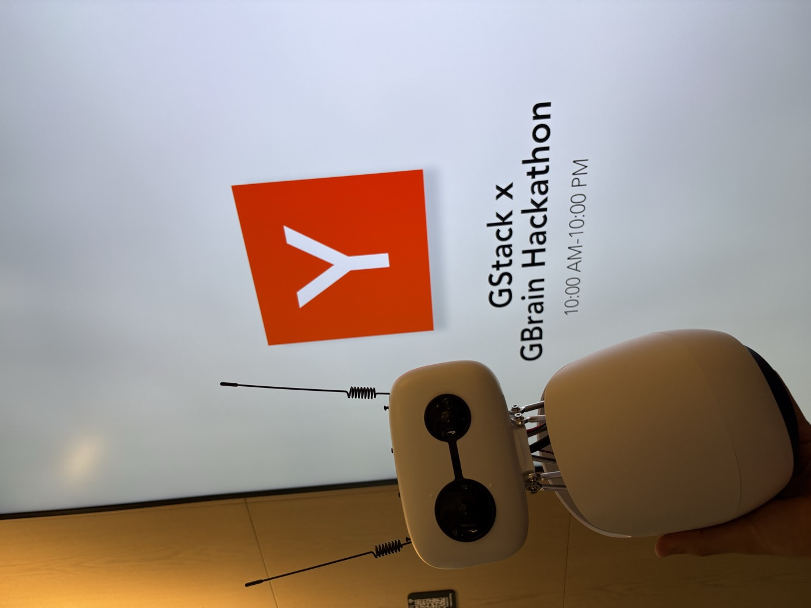
</p>

### Interface

<p>
  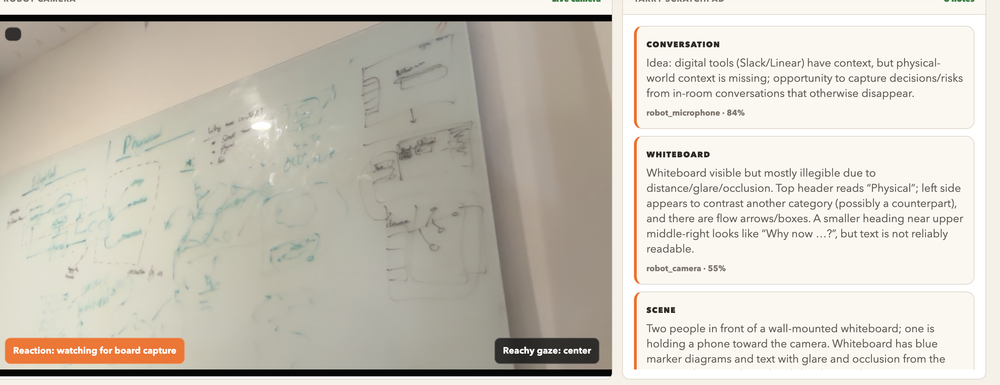
</p>

### Tarry At YC

<p>
  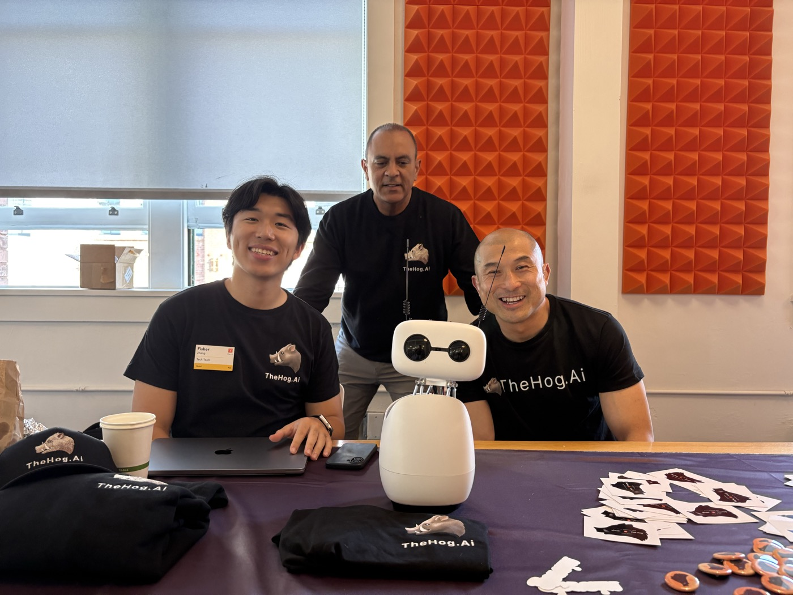
  
  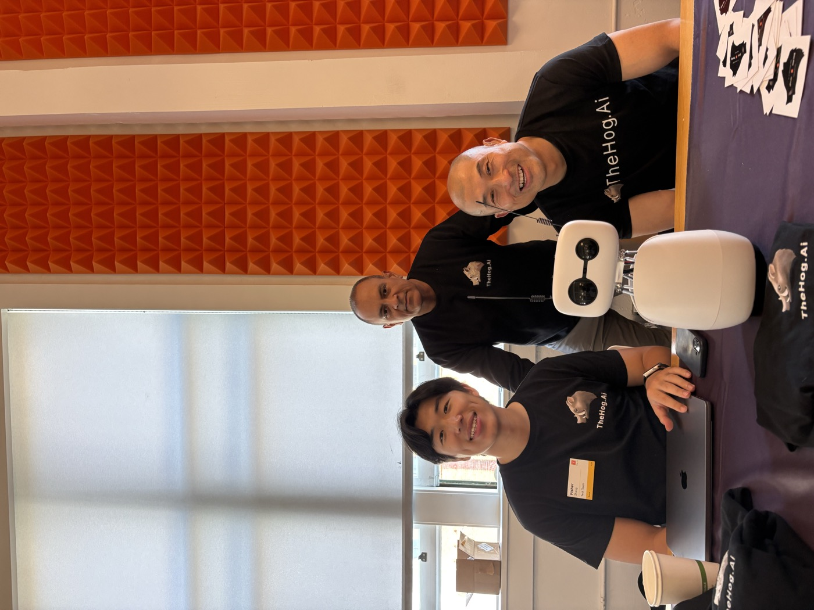
</p>

### Tarry With Robot Friends

<p>
  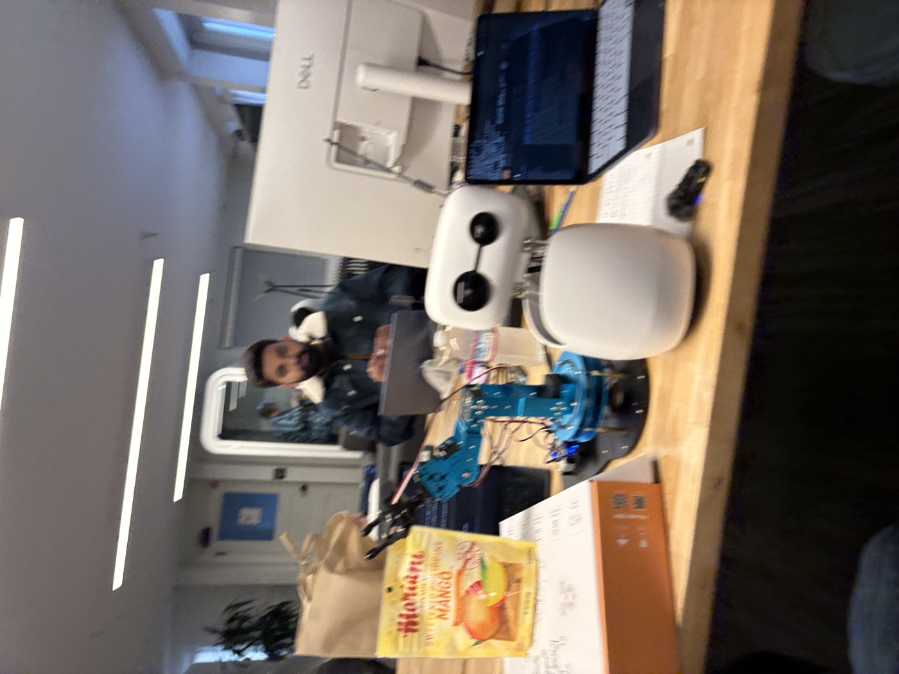
  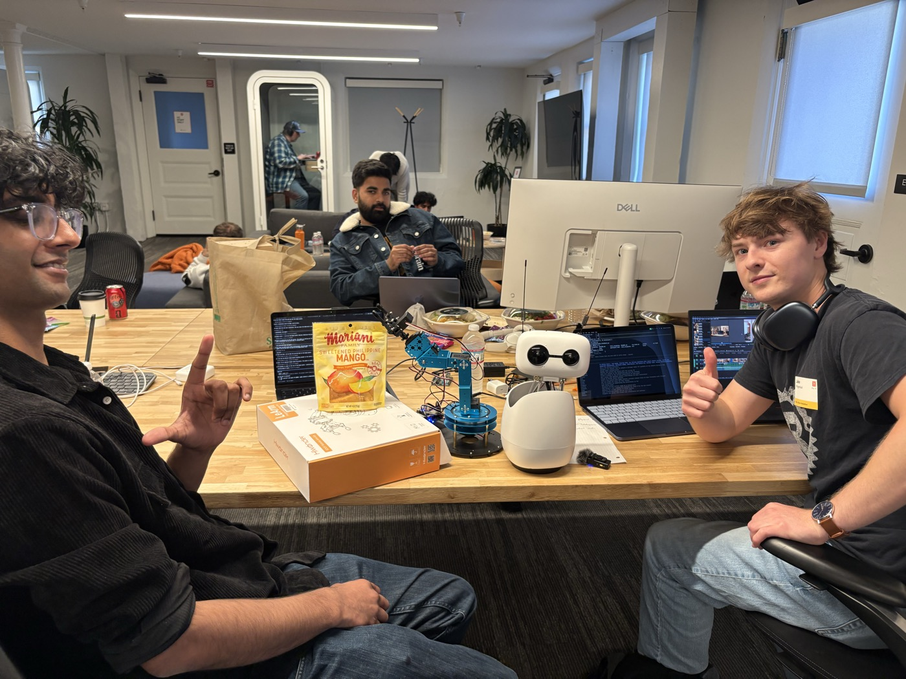
</p>

### Office Companion

<p>
  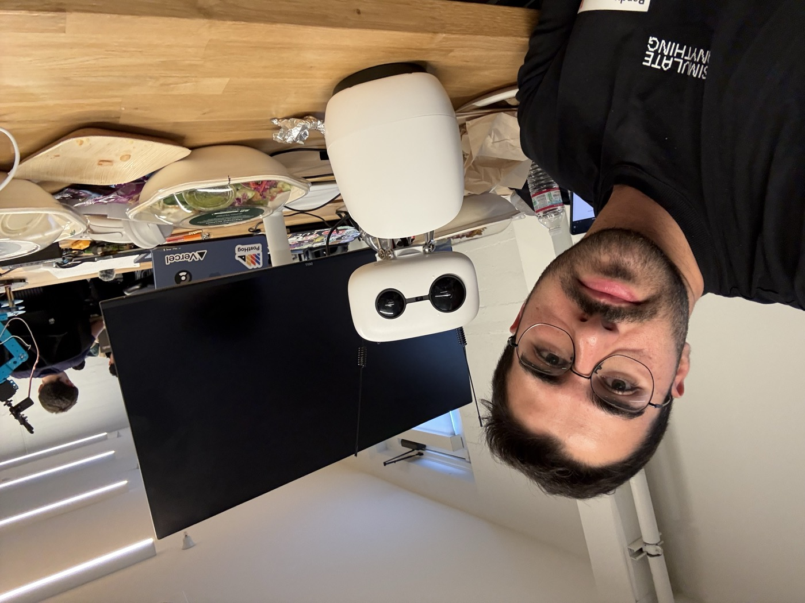
  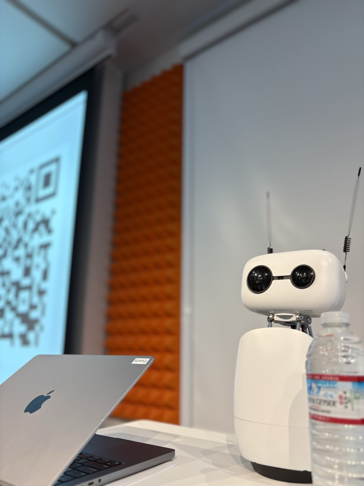
</p>

### Demo Room

<p>
  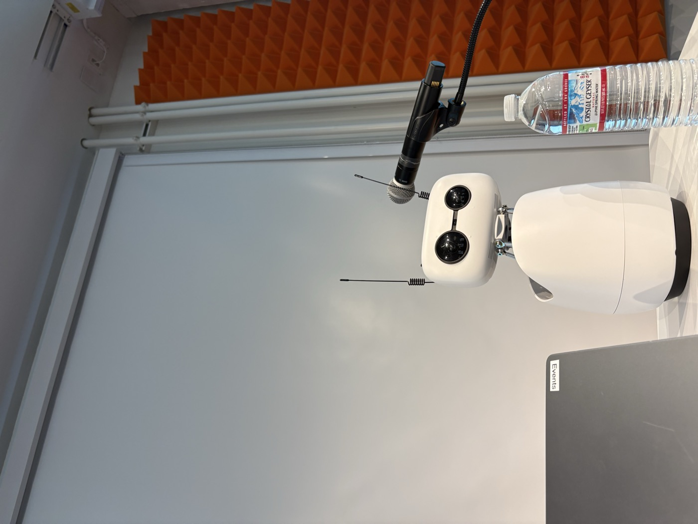
  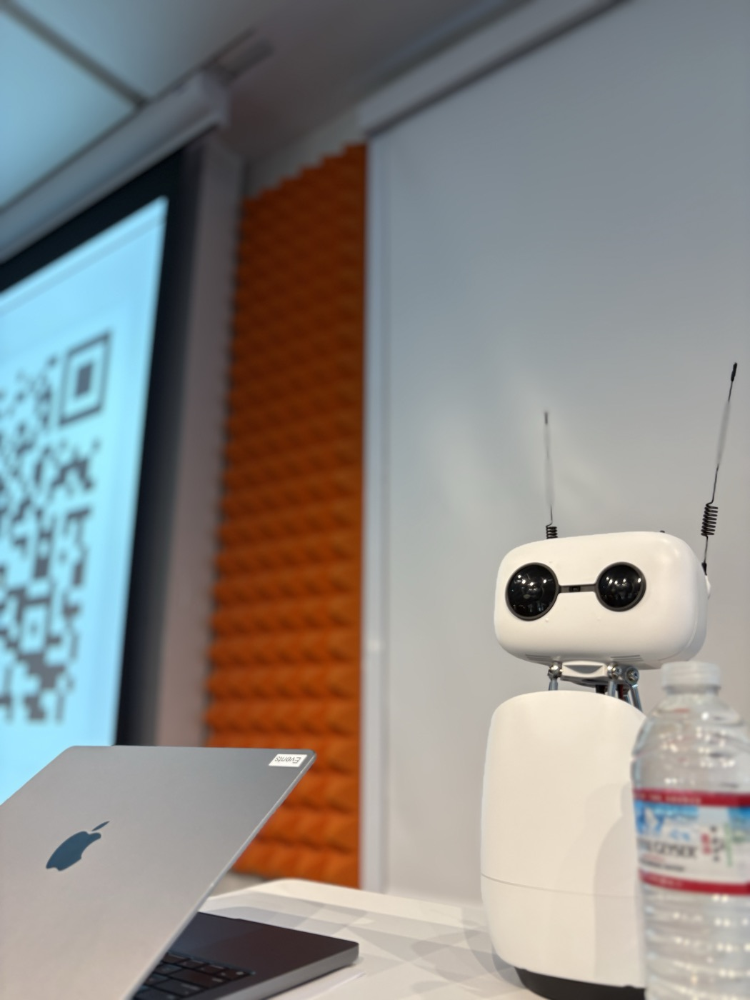
  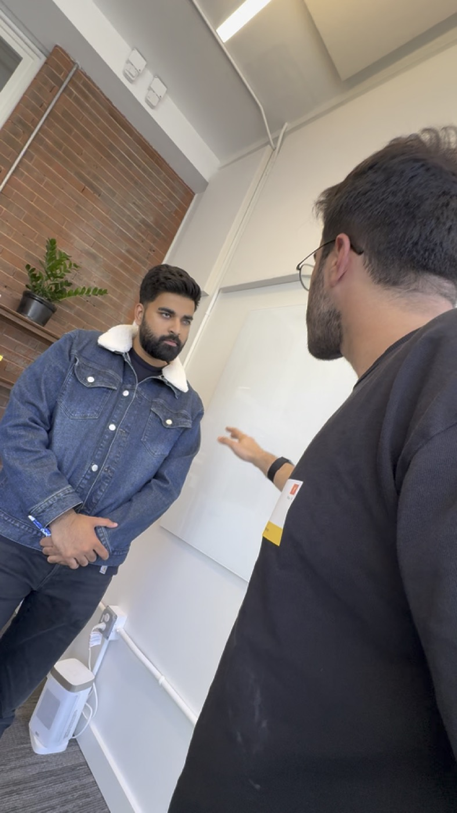
</p>

## Demo Loop

1. Two founders debate around a whiteboard.
2. Tarry watches and listens.
3. Someone says, "Tarry, capture the whiteboard."
4. Tarry scans the board and writes live notes.
5. The team asks a memory question later.
6. GBrain retrieves the physical-room context.

## What It Does

- Sees the room through Reachy Mini.
- Listens to in-person team conversations.
- Reads messy whiteboards and takes its best guess when the image is blurry.
- Writes live working notes into a Scratchpad.
- Saves important context into GBrain for later retrieval.
- Lets the team ask, "What did we decide?" after the meeting is over.

## Stack

- Reachy Mini for embodiment and robot camera.
- OpenAI Realtime for live audio, image input, and tool calls.
- Tarry Scratchpad for live working notes.
- GBrain for durable memory and retrieval.
- Local dashboard for the demo surface.

## Run

```bash
npm run agent:serve
npm run dashboard
```

Open:

```text
http://127.0.0.1:5173/
```

Then click `Start Tarry` and say:

```text
Tarry, capture the whiteboard.
```

## Status

The current demo path is focused on camera plus Scratchpad. The main screen intentionally stays simple: Robot Camera on the left, Tarry Scratchpad on the right, with debug panels hidden behind a toggle.
